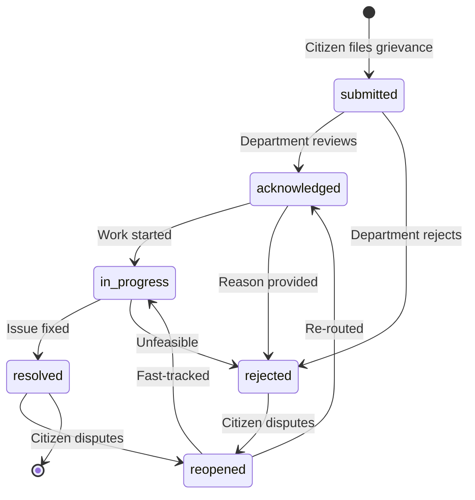

# NAMO Jan Connect

A Cloudflare-native complaint-management platform with anonymous citizen reporting, isolated department queues, and central administrator oversight.

## Production architecture

| Layer | Cloudflare service | Purpose |
|---|---|---|
| Frontend | Pages | React 19 + Vite single-page application |
| API | FastAPI on Python Workers | Typed HTTP routing, authentication, complaint routing, tracking, and administration |
| Relational data | D1 | Citizens, departments, complaints, history, sessions, and contact records |
| Key-value store | Workers KV (`NJC_OFFICERS_KV`) | Officer assignments per department, password reset tokens |
| Object storage | R2 Standard | Complaint evidence and department resolution photographs |

No application data is written to local SQLite, PostgreSQL, or a local uploads folder. The Worker accesses D1 and R2 through native bindings; no database passwords or R2 access keys are exposed to the application.

Python Workers are currently a Cloudflare beta feature. The implementation uses the required `python_workers` compatibility flag and Cloudflare's ASGI adapter to run FastAPI. Interactive API documentation is available at `/docs` and the OpenAPI schema at `/openapi.json`.

## Database schema

Source: [`backend/migrations/0001_initial.sql`](backend/migrations/0001_initial.sql) · Domain constants: [`backend/src/domain.py`](backend/src/domain.py)

### Entity relationship diagram (Conceptual - Chen's Notation)

```mermaid
flowchart TD
    %% ─── Entities (Rectangles) ───
    Users[users]
    Complaints[complaints]
    Departments[departments]
    Portals[department_portals]
    Sessions[staff_sessions]
    Attachments[complaint_attachments]
    History[status_history]
    Feedback[feedback]
    Contact[contact_messages]

    %% ─── Relationships (Diamonds) ───
    rel_files{files}
    rel_belongs{belongs_to}
    rel_manages{manages}
    rel_session{authenticates}
    rel_routes{routes_to}
    rel_uploads{uploads}
    rel_contains{contains}
    rel_updates{updates}
    rel_logs{logs}
    rel_receives{receives}
    rel_reference{references}

    %% ─── Connections between Entities and Relationships ───
    Users --- rel_files --- Complaints
    Users --- rel_belongs --- Departments
    Departments --- rel_manages --- Portals
    Users --- rel_session --- Sessions
    Complaints --- rel_routes --- Departments
    Users --- rel_uploads --- Attachments
    Complaints --- rel_contains --- Attachments
    Users --- rel_updates --- History
    Complaints --- rel_logs --- History
    Complaints --- rel_receives --- Feedback
    Contact --- rel_reference --- Complaints

    %% ─── Attributes (Ovals) ───
    %% Users Attributes
    u_id([id])
    u_name([name])
    u_email([email])
    u_phone([phone])
    u_role([role])
    Users --- u_id
    Users --- u_name
    Users --- u_email
    Users --- u_phone
    Users --- u_role

    %% Complaints Attributes
    c_id([id])
    c_track([tracking_id])
    c_title([title])
    c_desc([description])
    c_status([status])
    c_priority([priority])
    c_loc([location_text])
    c_sla([sla_due_at])
    Complaints --- c_id
    Complaints --- c_track
    Complaints --- c_title
    Complaints --- c_desc
    Complaints --- c_status
    Complaints --- c_priority
    Complaints --- c_loc
    Complaints --- c_sla

    %% Departments Attributes
    d_id([id])
    d_name([name])
    d_cat([category])
    d_sla([sla_days])
    Departments --- d_id
    Departments --- d_name
    Departments --- d_cat
    Departments --- d_sla

    %% Portals Attributes
    p_id([id])
    p_pid([portal_id])
    p_email([staff_email])
    Portals --- p_id
    Portals --- p_pid
    Portals --- p_email

    %% Sessions Attributes
    s_id([id])
    s_hash([token_hash])
    s_exp([expires_at])
    Sessions --- s_id
    Sessions --- s_hash
    Sessions --- s_exp

    %% Attachments Attributes
    a_id([id])
    a_key([object_key])
    a_type([file_type])
    Attachments --- a_id
    Attachments --- a_key
    Attachments --- a_type

    %% History Attributes
    h_id([id])
    h_old([old_status])
    h_new([new_status])
    h_rem([remarks])
    History --- h_id
    History --- h_old
    History --- h_new
    History --- h_rem

    %% Feedback Attributes
    f_id([id])
    f_rating([rating])
    f_comm([comment])
    Feedback --- f_id
    Feedback --- f_rating
    Feedback --- f_comm

    %% Contact Attributes
    co_id([id])
    co_name([name])
    co_email([email])
    co_msg([message])
    Contact --- co_id
    Contact --- co_name
    Contact --- co_email
    Contact --- co_msg

    %% ─── Style Definitions (GIGW / Emerald Green Theme) ───
    classDef entity fill:#f0fdf4,stroke:#10b981,stroke-width:2px,color:#065f46,font-weight:bold;
    classDef relation fill:#f0fdf4,stroke:#10b981,stroke-width:2px,color:#065f46;
    classDef attribute fill:#ffffff,stroke:#10b981,stroke-width:1.5px,color:#065f46;

    class Users,Complaints,Departments,Portals,Sessions,Attachments,History,Feedback,Contact entity;
    class rel_files,rel_belongs,rel_manages,rel_session,rel_routes,rel_uploads,rel_contains,rel_updates,rel_logs,rel_receives,rel_reference relation;
    class u_id,u_name,u_email,u_phone,u_role,c_id,c_track,c_title,c_desc,c_status,c_priority,c_loc,c_sla,d_id,d_name,d_cat,d_sla,p_id,p_pid,p_email,s_id,s_hash,s_exp,a_id,a_key,a_type,h_id,h_old,h_new,h_rem,f_id,f_rating,f_comm,co_id,co_name,co_email,co_msg attribute;
```




### Entities

| Table | Role | Key columns |
|---|---|---|
| `departments` | The 5 government departments that handle complaints | `category` (enum), `sla_days` |
| `department_portals` | Portal credentials and stable ID per department | `portal_id`, `staff_email` |
| `users` | Unified table for citizens, department staff, and admins | `role`, `department_id` |
| `staff_sessions` | Bearer-token auth for department and admin staff | `token_hash` (SHA-256), `expires_at` |
| `complaints` | Core entity — every public grievance | `tracking_id`, `status`, `sla_due_at`, GPS coords |
| `complaint_attachments` | Evidence and resolution photos stored in R2 | `object_key`, `file_type` |
| `status_history` | Immutable audit trail — every status transition | `old_status → new_status`, `remarks` |
| `feedback` | Citizen satisfaction rating after resolution | `rating` (1–5), `comment` |
| `contact_messages` | Free-form messages from the contact page | `tracking_id` soft-link, `status` |

### Complaint status lifecycle



Valid transitions are enforced in [`domain.py`](backend/src/domain.py) via the `TRANSITIONS` map and validated in the Worker before any `UPDATE` is executed against D1.

### Indexes

| Index | Columns | Purpose |
|---|---|---|
| `idx_complaints_department_status` | `(department_id, status)` | Fast department queue filtering |
| `idx_complaints_tracking` | `(tracking_id)` | Public tracking ID lookup |
| `idx_sessions_token` | `(token_hash, expires_at)` | Auth token validation |
| `idx_history_complaint` | `(complaint_id, changed_at)` | Chronological audit trail per complaint |


## Repository layout

- `frontend/` - React, Vite, Pages configuration, and SPA redirects.
- `frontend/src/api.ts` - API helpers including Cloudflare KV officer management and password reset.
- `frontend/src/components/PublicLayout.tsx` - Shared layout wrapper for public-facing pages (About, Gallery, How It Works).
- `frontend/src/components/ForgotPasswordModal.tsx` - Staff password reset modal (sends reset token via SMTP).
- `backend/src/` - FastAPI application and Python Worker ASGI entry point.
- `backend/migrations/` - D1 schema and initial department portal records.
- `backend/wrangler.jsonc` - Worker, D1, R2, and KV binding configuration.
- `.env.example` - local frontend values and required Worker secret names.

## Cloudflare provisioning

Install Node.js, Wrangler, Python 3.13+, `uv`, and the Python Worker tooling. Authenticate Wrangler with your Cloudflare account before provisioning.

1. Create the D1 database:

```powershell
npx wrangler d1 create namo-jan-connect
```

Copy the returned database ID into `backend/wrangler.jsonc`, replacing `REPLACE_WITH_D1_DATABASE_ID`.

2. Create the private R2 bucket:

```powershell
npx wrangler r2 bucket create namo-jan-connect-evidence
```

3. Create the KV namespace for officer data and password reset tokens:

```powershell
npx wrangler kv namespace create NJC_OFFICERS_KV
```

Copy the returned namespace ID into `backend/wrangler.jsonc` under the `kv_namespaces` binding.

4. Apply the D1 schema and seed the five department portal IDs:

```powershell
cd backend
npx wrangler d1 migrations apply namo-jan-connect --remote
```

5. Configure encrypted staff credentials and Gmail SMTP secrets:

```powershell
uv run pywrangler secret put ADMIN_EMAIL
uv run pywrangler secret put ADMIN_PASSWORD
uv run pywrangler secret put SMTP_USER
uv run pywrangler secret put SMTP_PASS
```

*Note: `SMTP_USER` is the sender Gmail address and `SMTP_PASS` is the Gmail App Password. SMTP credentials are also used to deliver password reset tokens to department staff.*


6. Deploy the Python Worker:

```powershell
uv run pywrangler deploy
```

7. Set `VITE_API_URL` to the deployed Worker URL and deploy React to Pages:

```powershell
npm run deploy:frontend
```

The Worker allows local development and the deployed Cloudflare Pages/Vercel origins through the comma-separated `FRONTEND_URL` setting.

### Vercel frontend deployment

The React frontend also includes `frontend/vercel.json` for Vite builds and SPA routing on Vercel. Deploy it with `npm run deploy:vercel`; the FastAPI Worker, D1 database, R2 bucket, and gallery media remain on Cloudflare.

Production frontend: `https://namo-jan-connect.vercel.app`

## Local development

Wrangler provides local D1 and R2 simulations under `.wrangler/`; production data is not modified during ordinary local development.

```powershell
copy .env.example .env
npm install
npm run dev:backend
```

In a second terminal:

```powershell
npm run dev:frontend
```

Open `http://localhost:5173`. The local Worker API runs at `http://localhost:8787`.

Apply migrations to the local D1 simulator when needed:

```powershell
cd backend
npx wrangler d1 migrations apply namo-jan-connect --local
```

## Application URLs

| Area | Local URL | Sign-in identifier |
|---|---|---|
| Public citizen site | `http://localhost:5173/` | No login required |
| Portal directory | `http://localhost:5173/dashboard` | No login required |
| Citizen dashboard | `http://localhost:5173/citizen` | No login required |
| Civic & Infrastructure | `http://localhost:5173/civic-infra` | `NJC-CIVIC-01` |
| Health & Education | `http://localhost:5173/health-education` | `NJC-HEALTH-01` |
| Law & Order | `http://localhost:5173/law-order` | `NJC-SAFETY-01` |
| Transport & Public Services | `http://localhost:5173/transport` | `NJC-TRANSPORT-01` |
| Employment & Welfare | `http://localhost:5173/employment-welfare` | `NJC-WELFARE-01` |
| Administrator | `http://localhost:5173/admin` | `ADMIN_EMAIL` secret |

`/civil-department` remains an alias for `/civic-infra`.

Portal IDs are assigned by the D1 seed migration and remain stable identifiers for routing and administration. The administrator configures a required staff email and a different password for each portal from `/admin`. Department staff sign in with that email and portal-specific password; passwords are stored only as salted PBKDF2 hashes in D1.

## Officer management

Each department maintains its own roster of assigned officers (field inspectors, engineers, support staff). Officer data is persisted in Cloudflare Workers KV under the `NJC_OFFICERS_KV` namespace, keyed by department category (e.g., `officers:civic_infra`).

| API endpoint | Method | Purpose |
|---|---|---|
| `/kv/officers/:category` | `GET` | Retrieve officers for a department |
| `/kv/officers/:category` | `POST` | Save or update the officer roster |
| `/kv/reset-password` | `POST` | Request a password reset token (sent via SMTP) |

- Department staff can add or remove officers from the **Team workload** section of the department sidebar.
- The administrator can view officer performance across all departments from the admin portal.
- No officer data is stored in `localStorage` or hard-coded in the frontend; all reads and writes go through the KV-backed API.

## Password reset

Department staff who forget their password can request a reset from the login screen. The flow:

1. Staff clicks **Forgot Password** and enters their registered email address.
2. The Worker generates a time-limited reset token, stores it in KV (15-minute TTL), and sends it to the staff email via Gmail SMTP.
3. Staff uses the token to set a new password, which is stored as a salted PBKDF2 hash in D1.

No CAPTCHA is required. Rate limiting is not currently enforced on the reset endpoint.

## Data and privacy behavior

- Citizen email address is optional. If provided, the platform automatically sends email updates (complaint filing confirmation and subsequent status transitions) via Gmail SMTP using Cloudflare TCP sockets.
- D1 stores relational records and R2 object keys.
- KV stores officer rosters per department and short-lived password reset tokens.
- R2 stores the image bytes under complaint-specific prefixes.
- Public tracking responses omit citizen email and phone.
- Public gallery access is limited to resolution images.
- Department queries are filtered by the authenticated staff member's `department_id` in the Worker.
- Staff bearer tokens are stored as SHA-256 hashes in D1 and expire automatically.
- Password reset tokens are stored in KV with a 15-minute TTL and are single-use.
- Images are limited to JPG, PNG, or WEBP and the configured size limit.

## Validation

```powershell
npm test
python -m pytest backend/tests
python -m compileall -q backend/src
```
